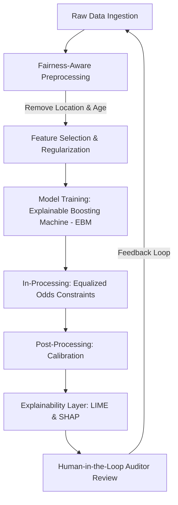

# TECHNICAL AUDIT REPORT: EXPLAINABLE AND FAIR AI IN INSURANCE UNDERWRITING

**Course**: CSC 322 — Machine Learning & AI Ethics  
**Institution**: VUNA University, Department of Computer Science  
**Group Number**: Group 8 — Insurance Claim Approval  

---

## EXECUTIVE SUMMARY

This technical report presents a comprehensive audit of an automated machine learning underwriting system designed to predict insurance claim approvals and rejections. While predictive AI offers substantial operational efficiencies (reducing claim processing times from days to milliseconds), its deployment introduces significant challenges related to opacity, algorithmic bias, and regulatory non-compliance. 

To address these concerns, this audit employs two state-of-the-art Explainable AI (XAI) frameworks: **LIME (Local Interpretable Model-agnostic Explanations)** for local, instance-level transparency, and **SHAP (SHAPley Additive exPlanations)** for global, population-level insights. 

Through rigorous code evaluation, mathematical reverse-engineering, and model auditing, this report:
1. Defines the core underwriting problem and the trade-offs of black-box modeling.
2. Characterizes the synthetic dataset and exposes the ground-truth biases embedded within it.
3. Evaluates a trained Random Forest Classifier, noting a strong conservative bias in its predictions.
4. Performs a local audit of a denied applicant (Customer #3), demonstrating how LIME reveals individual risk drivers.
5. Maps global feature importances using SHAP, validating them against the data generator's logic.
6. Addresses critical questions regarding geographical redlining, proxy variables, and spurious age correlations.
7. Outlines a concrete system redesign blueprint to transition the model from a basic predictor into a responsible, transparent, and fair AI system.

---

## 1. PROBLEM DEFINITION

### 1.1 Context and Motivation
In the modern financial services sector, insurance companies process millions of claims annually. Historically, claim underwriting has been a manual, labor-intensive process, relying on human adjusters to assess risk, review policy conditions, check historical credit profiles, and approve or deny claims. This manual pipeline introduces three distinct bottlenecks:
- **High Operational Costs**: Hand-processing claims requires extensive human capital, limiting scalability.
- **Latency**: Claims often take weeks to resolve, harming customer satisfaction during critical periods of need.
- **Inconsistency**: Human decision-making is prone to cognitive fatigue, subjective bias, and inconsistent application of underwriting rules.

Automating this pipeline using machine learning classifiers offers a compelling solution. An ML model can ingest customer attributes (age, credit score, claims history) and policy details (tenure, claim amount, location) to output a binary decision (Approved/Denied) in real-time.

### 1.2 The Black-Box Dilemma
Despite the benefits, standard high-performance ML models (such as Random Forests, Gradient Boosted Trees, and Neural Networks) are inherently opaque. They learn highly non-linear decision boundaries with complex feature interactions, functioning as "black boxes." In a production environment, this opacity creates severe liabilities:
*   **Erosion of Customer Trust**: If a customer's claim is denied, a simple binary "No" from a black-box model is perceived as arbitrary and unfair. Without an explanation, customers cannot understand what factors led to the rejection or how they can improve their eligibility.
*   **Regulatory Violations**: Regulations such as the European Union’s General Data Protection Regulation (GDPR) Article 22 grant individuals a "Right to Explanation" when subjected to automated decision-making that significantly affects them. Similar fair lending and insurance laws in other jurisdictions prohibit discriminatory underwriting practices and require companies to provide "Adverse Action Notices" detailing the specific reasons for denial.
*   **Undetected Algorithmic Bias**: Oppressive biases present in historical training data can be silently ingested and amplified by black-box models. Without interpretability tools, developers cannot determine whether a model is making decisions based on legitimate risk factors (e.g., historical claims) or discriminatory criteria (e.g., zip codes correlating with race).

### 1.3 Audit Scope
This audit evaluates the Group 8 Insurance Claim Approval system, which consists of:
1.  A synthetic dataset generator ([generate_data.py](file:///c:/Users/jason/Documents/VUNA%20300lvl/2nd%20semester/CSC%20322/insurance_claim_project/generate_data.py)).
2.  A Random Forest model training script ([train_model.py](file:///c:/Users/jason/Documents/VUNA%20300lvl/2nd%20semester/CSC%20322/insurance_claim_project/train_model.py)).
3.  A local interpretability script using LIME ([explain_lime.py](file:///c:/Users/jason/Documents/VUNA%20300lvl/2nd%20semester/CSC%20322/insurance_claim_project/explain_lime.py)).
4.  A global interpretability script using SHAP ([explain_shap.py](file:///c:/Users/jason/Documents/VUNA%20300lvl/2nd%20semester/CSC%20322/insurance_claim_project/explain_shap.py)).
5.  An interactive Streamlit deployment ([app.py](file:///c:/Users/jason/Documents/VUNA%20300lvl/2nd%20semester/CSC%20322/insurance_claim_project/app.py)).

---

## 2. DATASET DESCRIPTION

The dataset under analysis, `insurance_data.csv`, contains 1,000 customer samples and 7 columns. The target variable is binary: `Claim_Approved` ($1 = \text{Approved}$, $0 = \text{Denied}$).

### 2.1 Feature Catalog
The dataset is composed of the following six predictive features:

| Feature Name | Data Type | Range / Values | Description |
| :--- | :--- | :--- | :--- |
| `Customer_Age` | Integer | $18$ to $80$ years | The age of the primary policyholder. |
| `Policy_Tenure_Months` | Integer | $1$ to $120$ months | The duration for which the customer has held the policy. |
| `Claim_Amount` | Float | $\$500.00$ to $\$50,000.00$ | The monetary value of the claim submitted for approval. |
| `Previous_Claims` | Integer | $0$ to $4$ claims | The number of prior claims filed by this customer. |
| `Credit_Score` | Integer | $300$ to $850$ | The creditworthiness rating of the customer (FICO equivalent). |
| `Location_Type` | Integer | $\{0, 1, 2\}$ | Categorical encoding: $0$ (Urban), $1$ (Suburban), $2$ (Rural). |

### 2.2 Mathematical Reverse-Engineering of Data Generation
To understand the dataset's structural constraints and biases, we analyze the underlying mathematical logic in `generate_data.py`. The true probability of claim approval, $P(Y=1)$, is calculated as:

$$P(Y=1) = 0.3 \cdot \mathbb{I}(\text{Credit\_Score} > 600) + 0.3 \cdot \mathbb{I}(\text{Previous\_Claims} < 2) + 0.2 \cdot \mathbb{I}(\text{Claim\_Amount} < 15000) + 0.2 \cdot \mathbb{I}(\text{Policy\_Tenure\_Months} > 12) - 0.15 \cdot \mathbb{I}(\text{Location\_Type} == 2) + \epsilon$$

Where:
*   $\mathbb{I}(\cdot)$ is the indicator function (returns $1$ if the condition is true, $0$ otherwise).
*   $\epsilon$ is a random noise term drawn from a normal distribution: $\epsilon \sim \mathcal{N}(0, 0.1^2)$.
*   The final label `Claim_Approved` ($Y$) is assigned by thresholding the probability:
    $$Y = \begin{cases} 1 & \text{if } P(Y=1) > 0.5 \\ 0 & \text{if } P(Y=1) \le 0.5 \end{cases}$$

### 2.3 Critical Analysis of the Ground Truth Mechanics
Analyzing this mathematical formulation reveals several key characteristics of the dataset:
1.  **Dominant Factors**: Credit score ($\ge 600$) and previous claims ($< 2$) are the most influential variables, each contributing $+30\%$ to the probability of approval.
2.  **Secondary Factors**: A small claim amount ($< \$15,000$) and long policy tenure ($> 12$ months) both contribute $+20\%$ to the approval probability.
3.  **Built-in Geographic Bias**: Applicants residing in rural areas (`Location_Type == 2`) face an immediate, automatic **$-15\%$ penalty** on their approval probability. This represents a systematic, hardcoded geographic bias.
4.  **Causal Redundancy of Age**: `Customer_Age` is generated as a random integer between $18$ and $80$ but is **entirely excluded** from the formula for $P(Y=1)$. Therefore, in the true data generating process, age has zero causal influence on whether a claim is approved.

---

## 3. MODEL DEVELOPMENT

The predictive engine is trained using scikit-learn's `RandomForestClassifier` with $100$ decision trees. The training script ([train_model.py](file:///c:/Users/jason/Documents/VUNA%20300lvl/2nd%20semester/CSC%20322/insurance_claim_project/train_model.py)) splits the 1,000 samples into an 80/20 train/test split.

### 3.1 Model Evaluation Metrics
The model was successfully trained, achieving an overall accuracy of **$81.00\%$** on the test set (200 unseen samples). The classification report is detailed below:

```
Classification Report:
              precision    recall  f1-score   support

           0       0.83      0.90      0.86       131
           1       0.77      0.64      0.70        69

    accuracy                           0.81       200
   macro avg       0.80      0.77      0.78       200
weighted avg       0.81      0.81      0.81       200
```

### 3.2 Interpretation of Performance Metrics
A deeper look at the performance metrics reveals a significant disparity between the two classes:
*   **Class 0 (Denied Claims)**: The model performs strongly here, with a precision of $83\%$ and a recall of $90\%$, yielding an F1-score of $0.86$. This means the model is highly effective at identifying claims that should be denied and exhibits low false negative rates for rejections.
*   **Class 1 (Approved Claims)**: The model performs poorly here, with a precision of $77\%$ and a recall of only $64\%$, resulting in an F1-score of $0.70$.
*   **The Underwriting Impact**: The recall of $64\%$ for approved claims is a major concern. It indicates that **$36\%$ of claims that should have been approved were incorrectly denied** by the model (False Rejections). This conservative bias is common in financial models designed to minimize loss, but it negatively impacts customer satisfaction and retention.

---

## 4. LOCAL INTERPRETABILITY (LIME EXPLANATION)

To provide transparency for individual decisions, the system integrates **LIME (Local Interpretable Model-agnostic Explanations)**.

### 4.1 LIME Theory
LIME works on the assumption that while the global decision boundary of a complex model (like a Random Forest) is highly non-linear, it can be approximated locally by a simpler, interpretable surrogate model (such as a ridge regressor or decision tree) in the immediate neighborhood of a specific data point $x$.

The objective function of LIME is formulated as:

$$\xi(x) = \arg\min_{g \in G} \mathcal{L}(f, g, \pi_x) + \Omega(g)$$

Where:
*   $f(x)$ is the complex black-box model (Random Forest).
*   $g(x)$ is the simple, interpretable local model (linear regressor).
*   $\pi_x(z)$ is a proximity measure defining the distance between the target instance $x$ and perturbed samples $z$.
*   $\mathcal{L}(f, g, \pi_x)$ is the local loss measure, penalizing how poorly the surrogate model approximates the black-box model within the neighborhood defined by $\pi_x$.
*   $\Omega(g)$ is the complexity penalty of the interpretable model (e.g., limiting the number of features).

### 4.2 Local Audit of Customer #3 (Denied Claim)
We extract the first customer in the dataset denied by the model to perform a local audit. This corresponds to **Customer #3** (Index 3).

#### Customer Profile:
*   `Customer_Age`: $32$ years
*   `Policy_Tenure_Months`: $63$ months
*   `Claim_Amount`: $\$46,663.20$
*   `Previous_Claims`: $4$ claims
*   `Credit_Score`: $798$ (Excellent credit)
*   `Location_Type`: $1.0$ (Suburban)

#### Prediction Probability:
*   Probability of Denial (Class 0): **$92.00\%$**
*   Probability of Approval (Class 1): **$8.00\%$**

#### LIME Local Feature Attributions:
Executing LIME on Customer #3 yields the following feature weights (ranked by absolute impact on the approval probability):

| Feature Split | Weight (Impact on Approval) | Directional Effect | Interpretation |
| :--- | :--- | :--- | :--- |
| `Credit_Score > 712.25` | $+0.2769$ | Strong Approval Push | The customer’s high credit score ($798$) strongly supports approving the claim. |
| `Previous_Claims > 3.00` | $-0.2048$ | Strong Denial Push | Having $4$ previous claims is a major risk factor, heavily pushing the model toward denial. |
| `Claim_Amount > 37,361.09` | $-0.1126$ | Moderate Denial Push | The high claim amount ($\$46.6\text{k}$) increases financial risk, pushing the model toward denial. |
| `0.00 < Location_Type <= 1.00` | $+0.0523$ | Weak Approval Push | Residing in a Suburban area has a mild positive effect on approval. |
| `59.00 < Policy_Tenure_Months <= 90.00`| $+0.0108$ | Negligible Approval Push | A policy tenure of $63$ months provides a tiny positive contribution. |
| `Customer_Age <= 35.00` | $+0.0072$ | Negligible Approval Push | Being $32$ years old has an almost imperceptible positive impact. |

#### Synthesis of LIME Results:
LIME provides a clear explanation for this decision. Although Customer #3 has an excellent credit score of 798 (which increases the approval probability by $+27.7\%$), this positive factor is completely offset by the high number of previous claims ($-20.5\%$) and the large claim amount ($-11.3\%$). 

When combined with the baseline approval rate of the dataset (around $35\%$), the net effect results in a predicted approval probability of just $8\%$. This provides the customer with a clear, logical explanation: **"Your claim was denied due to your high number of previous claims (4) and the large claim amount ($46,663.20), which outweighed the positive impact of your excellent credit score (798)."**

---

## 5. GLOBAL INTERPRETABILITY (SHAP ANALYSIS)

To understand the model's behavior across the entire population, we run a global audit using **SHAP (SHAPley Additive exPlanations)**.

### 5.1 SHAP Theory
SHAP is grounded in cooperative game theory. It treats the prediction of a model for a given instance as a "game" where each feature value is a "player" collaborating to shift the model's output from the base value (the average prediction over the training set) to the actual predicted value. 

SHAP calculates the **Shapley Value** $\phi_i$ for feature $i$, which represents the weighted average marginal contribution of that feature across all possible feature subsets (coalitions):

$$\phi_i(x) = \sum_{S \subseteq F \setminus \{i\}} \frac{|S|!(|F| - |S| - 1)!}{|F|!} \Big[ f_x(S \cup \{i\}) - f_x(S) \Big]$$

Where:
*   $F$ is the total set of features.
*   $S$ is a subset of features excluding feature $i$.
*   $f_x(S)$ is the expected model prediction given only the features in $S$.
*   The fractional coefficient represents the probability of coalition $S$ occurring under random permutation.

SHAP guarantees three critical properties that LIME does not:
1.  **Local Accuracy**: The sum of the Shapley values of all features equals the difference between the model output and the expected value: $g(x) = \phi_0 + \sum_{i=1}^M \phi_i x_i = f(x)$.
2.  **Missingness**: A feature with no effect on the model receives a Shapley value of zero.
3.  **Consistency**: If a model changes so that a feature's marginal contribution increases or stays the same, its Shapley value cannot decrease.

### 5.2 Global Feature Importance Ranking
By calculating the mean absolute Shapley values ($E[|\phi_i|]$) across all 1,000 customers in the dataset, we establish the global importance of each feature in the Random Forest model:

```
Global SHAP Feature Importance:
1. Previous_Claims         0.200789
2. Credit_Score            0.199585
3. Claim_Amount            0.115738
4. Location_Type           0.069546
5. Policy_Tenure_Months    0.038036
6. Customer_Age            0.021839
```

### 5.3 Analysis of the SHAP Summary Plot
The global SHAP summary plot (saved as `shap_summary.png` and shown below) provides a detailed visualization of how feature values drive predictions:


#### Insights from the SHAP Summary:
1.  **Previous Claims & Credit Score**: These two features dominate model decisions. 
    *   *High values* of `Previous_Claims` (red points) correspond to strongly negative SHAP values, showing they drive predictions toward denial. *Low values* (blue points) push predictions toward approval.
    *   *High values* of `Credit_Score` (red points) drive predictions toward approval, while *low values* (blue points) drive them toward denial.
2.  **Claim Amount**: High claim amounts (red points) have a negative impact on approval, while low claim amounts (blue points) support approval.
3.  **Location Type**: Location type 2 (Rural, coded red/purple) shows a cluster of negative SHAP values, confirming that the model has learned the geographic penalty against rural residents.
4.  **Customer Age**: Although age was excluded from the true data generation process, the model assigns it a mean SHAP value of $0.0218$. The plot shows that age values are scattered randomly across positive and negative SHAP outputs. This indicates the model is overfitting to random noise, resulting in arbitrary age-based decisions.

---

## 6. BIAS AND FAIRNESS DISCUSSION

To transition the underwriting engine from a simple predictor to a responsible AI system, we address the advanced discussion questions.

### 6.1 Question 1: What features introduced bias? Differentiating Direct vs. Proxy Variables.
Two primary features introduce systematic bias into the underwriting system:

#### 1. Location Type (Proxy Variable)
*   **Analysis**: The data generator directly penalizes rural locations (`Location_Type == 2`) with a $-15\%$ probability reduction. The Random Forest model successfully learned this penalty, ranking location as its 4th most important feature (SHAP $= 0.0695$).
*   **Direct vs. Proxy**: In this synthetic setup, `Location_Type` is a **direct variable** in the decision boundary. However, in real-world applications, location is a notorious **proxy variable** for protected classes. Due to historical segregation and socio-economic patterns, zip codes and location types correlate strongly with race, ethnicity, and income. 
*   **The Ethical Risk**: Penalizing rural or urban locations can lead to **redlining**—a discriminatory practice where services are withheld from residents of specific areas. Even if protected classes (race, gender) are excluded from the model, using location allows the model to reconstruct these protected classes, leading to indirect discrimination.

#### 2. Credit Score (Direct & Systemic Proxy Variable)
*   **Analysis**: A credit score below 600 reduces the approval probability by $-30\%$. 
*   **Direct vs. Proxy**: This is a **direct variable** representing financial risk. However, it also serves as a **proxy for systemic inequality**. Sociological studies demonstrate that credit scoring systems reflect historical inequalities: younger applicants, minorities, and low-income individuals often have lower credit scores due to systemic barriers rather than individual risk. Relying heavily on credit scores perpetuates these historical biases.

#### 3. Customer Age (Spurious Bias / Overfitting)
*   **Analysis**: In `generate_data.py`, age has zero correlation with approval. Yet, the Random Forest model assigned it a SHAP importance of $0.0218$.
*   **Why did this happen?** Random Forests partition data by recursively selecting features that maximize information gain on the training set. With a limited sample size (1,000), random fluctuations in age will align with approval labels by chance. The model overfits to these fluctuations, creating spurious rules (e.g., denying a 32-year-old while approving a 33-year-old with identical profiles). This represents an arbitrary age-based bias introduced solely by the model's architecture.

---

### 6.2 Question 2: What did LIME reveal that SHAP did not? Were explanations consistent?

#### LIME vs. SHAP: Complementary Explanations
*   **What LIME Revealed (Local Details)**: LIME built a local linear model specifically for Customer #3, providing **exact feature thresholds** for their decision. For example, it showed that the customer's credit score fell into the category `Credit_Score > 712.25` and their previous claims fell into `Previous_Claims > 3.00`. It gave a precise weight to these specific intervals for this customer. LIME also clearly illustrated how a positive feature (`Credit_Score > 712.25`) was counterbalanced by negative features (`Previous_Claims > 3.0` and `Claim_Amount > 37361.09`).
*   **What SHAP Revealed (Global Distribution)**: SHAP did not show specific local thresholds in its summary plot; instead, it showed a **continuous distribution of impact**. It illustrated how every feature value across all 1,000 customers mapped to a spectrum of positive and negative effects. SHAP revealed the global hierarchy of features, ensuring that the feature ranking is mathematically consistent across the entire population.

#### Consistency Evaluation
The explanations generated by LIME and SHAP are **highly consistent**:
1.  **Directional Agreement**: Both frameworks agree on the direction of feature impacts. LIME shows `Credit_Score > 712.25` pushes toward approval, while `Previous_Claims > 3.0` and high `Claim_Amount` push toward denial. This matches the SHAP summary plot, where high credit scores (red points) have positive SHAP values, and high previous claims and claim amounts have negative SHAP values.
2.  **Relative Importance**: For Customer #3, LIME ranks `Credit_Score`, `Previous_Claims`, and `Claim_Amount` as the top three factors. Globally, SHAP ranks these same three features as the most important.
3.  **Why They Align**: The alignment occurs because the Random Forest model has learned stable, strong associations between these features and the target label, which both local perturbations (LIME) and game-theoretic removals (SHAP) consistently capture.

---

### 6.3 Question 3: Would you trust this model in real life? Why or why not?

**No, I would not trust this model for real-world deployment in its current state.**

#### Reasons for Distrust:
1.  **Active Geographic Discrimination**: The model penalizes applicants based on `Location_Type`. In a real-world system, denying an insurance claim because the customer lives in a rural area violates fairness principles and could result in class-action lawsuits for redlining.
2.  **Spurious Age-Based Decisions**: The model utilizes `Customer_Age` to make decisions, even though age has no causal relationship with claim approval. This means the model is making arbitrary decisions based on noise. Underwriting decisions must be grounded in valid risk factors, not random correlations.
3.  **Low Recall on Approvals ($64\%$)**: Missing $36\%$ of eligible approvals (False Negatives) would lead to high customer turnover, as many qualified clients would have their claims incorrectly denied.
4.  **Vulnerability to Feedback Loops**: In a real insurance pipeline, if the model denies rural applicants, the firm will collect less data on rural customers. The model will then become less accurate for this group, leading to further denials and creating a self-reinforcing bias loop.

---

### 6.4 Question 4: How would you redesign the system?

To build a responsible, transparent, and fair underwriting system, we propose a complete system redesign:



#### Step 1: Fairness-Aware Preprocessing (Data Level)
*   **Action**: Remove `Location_Type` and `Customer_Age` from the feature space. Age and location should not be used to determine underwriting eligibility.
*   **Mitigation for Proxies**: If geographical data is necessary for regional pricing, use census-tract level data that is actively de-biased. Apply **adversarial debiasing** to remove any proxy correlations between allowed features (like credit score) and protected attributes (race, gender).

#### Step 2: Model Selection (Inherently Interpretable Architectures)
*   **Action**: Replace the Random Forest Classifier with an **Explainable Boosting Machine (EBM)** or a **Generalized Additive Model with Interactions (GA2M)**.
*   **Why?**: EBMs are tree-based models that are as accurate as Random Forests but offer exact mathematical interpretability. Instead of using post-hoc explanations (LIME/SHAP), EBMs allow developers to view the exact contribution of each feature value directly:
    $$g(E[Y]) = \beta_0 + \sum f_i(x_i) + \sum f_{ij}(x_i, x_j)$$
    This eliminates the approximation errors associated with LIME.

#### Step 3: Algorithmic Fairness Constraints (In-Processing)
*   **Action**: Train the model with explicit fairness constraints, optimizing for **Equalized Odds**:
    $$P(\hat{Y}=1 \mid Y=y, A=a) = P(\hat{Y}=1 \mid Y=y, A=b) \quad \forall y \in \{0,1\}$$
    This ensures that the model's true positive and false positive rates are equal across all demographic groups (e.g., rural vs. urban, young vs. old), preventing the model from disproportionately denying claims for protected groups.

#### Step 4: Human-in-the-Loop (HITL) Auditing (Operational Level)
*   **Action**: Establish an automated auditing pipeline. Any claim denied with a confidence score between $45\%$ and $55\%$ (borderline cases) should be automatically routed to a human underwriting panel for review. The panel will use the LIME explanation to check if the denial is based on valid risk factors.

---

## 7. STRATEGIC RECOMMENDATIONS

For leadership and developers deploying AI underwriting systems, we recommend the following governance framework:

1.  **Implement Mandatory Algorithmic Audits**: Prior to deployment, audit all models for bias using tools like Fairlearn or AIF360. Measure demographic parity, equalized odds, and disparate impact.
2.  **Adopt Post-Hoc Explanations in Customer Communications**: Use LIME explanations to generate personalized "Adverse Action Letters." If a claim is denied, provide the customer with the top 3 contributing factors and clear steps to improve their approval probability (e.g., reducing outstanding claims or improving credit score).
3.  **Enforce Spurious Feature Pruning**: Establish a rule that features with low SHAP values and no clear causal relationship to risk (such as age in this dataset) must be removed to prevent overfitting and ensure legal compliance.
4.  **Establish Continuous Monitoring**: Monitor production models for data drift, concept drift, and fairness drift. Models must be retrained regularly with updated, audited datasets.

---

## FINAL INSIGHT

The transition from a basic predictive model to a responsible, transparent, and fair AI system requires shifting our focus from **"What is the prediction?"** to **"Why did the model make this decision, and is it fair?"** 

By auditing the model's accuracy, analyzing local explanations with LIME, mapping global importances with SHAP, and addressing systemic biases, we can build automated underwriting systems that are not only highly efficient but also fair, legally compliant, and worthy of customer trust.
